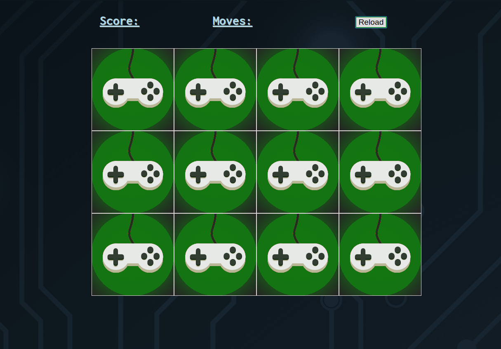

# Memory game

A simple browser game written in vanilla JavaScript with minimalist HTML structure and CSS style.

## Rules

At beginning of the game there is a board of cards turned upside-down, showing only their back side. Each card has exactly one twin-card, with the same front image.  

The game consist on choosing a pair of cards per move from the cardboard. Once clicked a card is flipped, showing its front image:
- If the two cards chosen have the same front image, they're removed from the cardboard and you gain a point. 

- If the chosen pair of cards have not the same image on them you gain no points; you must try to memorize their position because the cards are flipped back and you'll have to retry couple them with their twins during next rounds of flipping.

Each round of flipping cards increments the move counter, the game ends when all the cards are coupled with their twins. The lower moves number you have the better.

## Main features

The game is intented to be basic (especially in Css style), but over time some little features have been added to the first "raw" version:

- Difficulty level selection: _easy, normal(default) or hard_, influences the number of cards to couple. The higher difficulty, the higher number of cards as game begins. The more cards that have to be coupled, the more difficult to remember their positioning or get a twin couple by luck. Easy as that.

- Very simple points system: the move counter has a hard-coded top cap, if you make more moves than that cap to win the match, the counter turns red. Obviously this upper limit changes according to difficulty level.

- Cardset choice: simply a style choice. As for now there are 2 sets of cards to choose from, both front images and card back do change. To your taste.

- Mobile and touchscreen support: touchscreen device detection and 300ms touch delay removal. Also a little of style in _mobile.css_ to layout better on small screens.

## Other notes and contacts

To run the game you don't need any particular dependency. All you need is a web browser with JS support and to make sure you have all assets in their place into _images_ folder.

A screenshot on a desktop browser:

If you have any suggestion/problem/question please email me or open a Github issue.

| Name | Github profile | Email |
|------|----------------|-------|
|Federico Omodei | http://github.com/Fomodei94 | federico.omodei[at]gmail.com